# Mãos à obra App

## Visão Geral

Pequeno aplicativo para dispositivos móveis que tem o objetivo de gerenciar orçamentos de obras de construção civil a partir de dados colhidos junto ao SINAPI (​Sistema Nacional de Pesquisa de Custos e Índices da Construção Civil).

## Funcionalidades

### Health
- POST /health - Health check

### Autenticação
- POST /auth/login - Autenticar usuário

### Rotas GET - Obter todos
- GET /usuarios
- GET /clientes
- GET /enderecos
- GET /estados
- GET /municipios
- GET /bairros
- GET /itens
- GET /precos
- GET /projetos
- GET /projeto-itens

### Rotas GET - Buscar com filtros (search)
- GET /usuarios/search
- GET /clientes/search
- GET /enderecos/search
- GET /estados/search
- GET /municipios/search
- GET /bairros/search
- GET /itens/search
- GET /precos/search
- GET /projetos/search
- GET /projeto-itens/search

### Rotas GET - Específicas
- GET /usuarios/me
- GET /usuarios/{id}
- GET /clientes/{id}
- GET /enderecos/{id}
- GET /estados/{id}
- GET /municipios/{id}
- GET /bairros/{id}
- GET /itens/{id}
- GET /itens/preco?itemId={itemId}&estadoId={estadoId}   (retorna item + preço vigente no estado)
- GET /precos/{id}
- GET /projetos/{id}
- GET /projeto-itens/{id}

### Rotas POST - Criar
- POST /usuarios
- POST /clientes
- POST /enderecos
- POST /estados
- POST /municipios
- POST /bairros
- POST /itens
- POST /precos
- POST /projetos
- POST /projeto-itens

### Rotas PATCH - Atualizar
- PATCH /usuarios/{id}
- PATCH /clientes/{id}
- PATCH /enderecos/{id}
- PATCH /estados/{id}
- PATCH /municipios/{id}
- PATCH /bairros/{id}
- PATCH /itens/{id}
- PATCH /precos/{id}
- PATCH /projetos/{id}
- PATCH /projeto-itens/{id}

### Rotas DELETE - Remover
- DELETE /usuarios/{id}
- DELETE /clientes/{id}
- DELETE /enderecos/{id}
- DELETE /estados/{id}
- DELETE /municipios/{id}
- DELETE /bairros/{id}
- DELETE /itens/{id}
- DELETE /precos/{id}
- DELETE /projetos/{id}
- DELETE /projeto-itens/{id}

## Requisitos Funcionais (RF)

| Código | Requisito                                                                                                                                                                                                 | Ator                          | Relacionados |
| ------ | --------------------------------------------------------------------------------------------------------------------------------------------------------------------------------------------------------- | ----------------------------- | ------------ |
| RF01   | Gerenciar usuários: (id, nome, sobrenome, cpf, nascimento, email, funcao, senha, status, criado_em, atualizado_em)                                                                                        | Usuário / Admin               |              |
| RF02   | Gerenciar clientes: (id, usuario_id, endereco_id, nome, sobrenome, cpf, cnpj, nascimento, telefone, email, status, timestamps)                                                                            | Usuário                       | RF01, RF03   |
| RF03   | Gerenciar endereços: (id, logradouro, numero, complemento, usuario_id, bairro_id, pais, cep, status, timestamps)                                                                                          | Usuário                       | RF01, RF07   |
| RF04   | Gerenciar itens: (id, codigo, nomenclatura, unidade, status, timestamps)                                                                                                                                  | Admin                         |              |
| RF05   | Gerenciar estados: (id, codigo_uf, nome, uf, regiao, status, timestamps)                                                                                                                                  | Admin / Seed                  |              |
| RF06   | Gerenciar municípios: (id, nome, codigo, uf, status, timestamps)                                                                                                                                          | Admin / Seed                  | RF05         |
| RF07   | Gerenciar bairros: (id, codigo, nome, uf, status, timestamps)                                                                                                                                             | Admin / Seed                  | RF05         |
| RF08   | Gerenciar preços: (id, item_id, estado_id, valor, status, timestamps)                                                                                                                                     | Admin                         | RF04, RF05   |
| RF09   | Gerenciar projetos: (id, usuario_id, cliente_id, estado_id, nome, descricao, valor_total, status(EM_ANDAMENTO|CONCLUIDO|CANCELADO), timestamps)                                                           | Usuário                       | RF01, RF02   |
| RF10   | Gerenciar itens de projeto: (id, projeto_id, item_id, quantidade, preco (snapshot), codigo (snapshot), nomenclatura (snapshot), unidade (snapshot), valor_total, status, timestamps)                      | Usuário                       | RF04, RF08, RF09 |
| RF11   | Autenticar usuário via login (JWT); somente usuários ativos podem obter token.                                                                                                                           | Usuário                       | RF01         |
| RF12   | Ao adicionar item a projeto: capturar snapshot (preco vigente do par item/estado, codigo, nomenclatura, unidade) e calcular valor_total do item (quantidade * preco).                                    | Sistema                       | RF08, RF10   |
| RF13   | Ao alterar quantidade ou substituir preço snapshot de projeto_item: recalcular valor_total do item e atualizar valor_total agregado do projeto.                                                          | Sistema                       | RF10, RF09   |
| RF14   | Ao incluir/atualizar/remover (logical) projeto_item: recalcular valor_total do projeto = soma(valor_total itens ativos).                                                                                 | Sistema                       | RF09, RF10   |
| RF15   | Projeto só pode mudar para CONCLUIDO se possuir pelo menos um projeto_item ativo.                                                                                                                        | Sistema / Usuário             | RF09, RF10   |
| RF16   | Cancelar projeto (status CANCELADO) impede inclusão/alteração/exclusão de novos itens (somente leitura).                                                                                                 | Sistema                       | RF09, RF10   |
| RF17   | Endpoint /itens/preco deve retornar dados do item + preço vigente (se existir) para (item_id, estado_id).                                                                                                | Sistema                       | RF04, RF08   |
| RF18   | Listagens suportam paginação via parâmetros (skip, take) e filtros conforme rotas /search de cada recurso.                                                                                               | Sistema                       | RF01–RF10    |
| RF19   | Exclusões são lógicas (status = false) sem remover fisicamente registros referenciados.                                                                                                                  | Sistema                       | Todos        |
| RF20   | Persistir valor_total consolidado no projeto para otimizar consultas (denormalização controlada).                                                                                                        | Sistema                       | RF09, RF14   |
| RF21   | Persistir valor_total em cada projeto_item para histórico mesmo após mudança futura de preço base.                                                                                                       | Sistema                       | RF10, RF12   |


## Regras de Negócio (RN)

| **Código** | **Regra de Negócio** |
| ---------- | -------------------- |
| **RN01**   | E-mail de usuário é único; tentativa de criar duplicado gera erro. |
| **RN02**   | CPF (quando informado) de usuário ou cliente é único no sistema. |
| **RN03**   | Usuário com status INATIVO não pode autenticar (login falha). |
| **RN04**   | Rotas de administração (estados, municípios, bairros, itens, preços) exigem perfil/admin (flag internamente). |
| **RN05**   | Senha deve atender política mínima (>=6 caracteres no MVP). |
| **RN06**   | Preço vigente escolhido é o último registro ATIVO para (item, estado); se inexistente, cálculo falha. |
| **RN07**   | Cálculo de custo do projeto = soma(quantidade * valor_preço_vigente) de cada item ativo. |
| **RN08**   | Projeto não pode mudar para status CONCLUIDO sem pelo menos 1 item associado. |
| **RN09**   | Exclusões são lógicas (status INATIVO); não remover fisicamente entidades com dependências. |
| **RN10**   | Atualização de preço não retroaltera orçamentos já emitidos (usar snapshot ou recalcular somente sob ação explícita futura). |
| **RN11**   | Login retorna JWT com expiração; após expirar é necessário novo login. |
| **RN12**   | Tentativa de acesso sem token ou com token inválido retorna 401; sem permissão retorna 403. |
| **RN13**   | Propriedades não declaradas nos DTOs são descartadas (whitelist) para garantir integridade. |


## Requisitos Não Funcionais (RNF)

| **Código** | **Requisito**                                                                                                      | **Categoria**              | **Relacionados**    |
| ---------- | ------------------------------------------------------------------------------------------------------------------ | -------------------------- | ------------------- |
| **RNF01**      | Autenticação via JWT; senhas armazenadas com hash bcrypt                                                           | Segurança                  | RF11                |
| **RNF02**      | Tráfego de produção deve usar HTTPS                                                                                | Segurança                  | RF11                |
| **RNF03**      | p95 < 500 ms para operações CRUD com até 10k registros                                                             | Performance                | RF01–RF10           |
| **RNF04**      | Paginação obrigatória em listagens (parâmetros: skip/take ou page/limit)                                           | Escalabilidade             | Rotas GET           |
| **RNF05**      | Disponibilidade alvo MVP: 99% em horário comercial                                                                 | Disponibilidade            | Todos               |
| **RNF06**      | Logs estruturados (níveis: info, warn, error)                                                                      | Observabilidade            | Todos               |
| **RNF07**      | ValidationPipe com whitelist + transform ativo em todos DTOs                                                       | Segurança / Qualidade      | RF01–RF13           |
| **RNF08**      | Cobertura mínima de testes núcleo (auth, cálculo) >= 60% linhas                                                    | Manutenibilidade           | RF11–RF13           |
| **RNF09**      | Migrações somente via Prisma Migrate versionadas em VCS                                                            | Manutenibilidade           | Dados               |
| **RNF10**      | Minimização de dados pessoais; nenhuma senha ou token sensível em logs                                             | Compliance / Segurança     | RF01, RF02          |
| **RNF11**      | Limite de payload JSON: 2 MB                                                                                       | Segurança / Performance    | RF01–RF10           |
| **RNF12**      | Formato de erro consistente `{ "message": string|string[], "statusCode": number }`                                 | Usabilidade / Qualidade    | Todos               |
| **RNF13**      | Rate limiting básico (ex: 100 req/min/IP) em rotas sensíveis (auth/login)                                          | Segurança                  | RF11                |
| **RNF14**      | Logs de seed contendo total importado e rejeições para itens/preços                                                | Observabilidade            | RF04, RF08          |
| **RNF15**      | Aplicação containerizável (Dockerfile + variáveis via .env)                                                        | Deployabilidade            | Todos               |


### ERD



## Stack Tecnológica

### Módulo de infra

Microsserviço responsável por um pipeline simples de extração de dados da planilha SINAPI e dump direto no banco de dados Postgres.

#### Libs e frameworks utilizados:

- [Pandas](https://pandas.pydata.org/) - O estado da arte da manipulação de dataframes em Python
- [Psycopg2](https://pypi.org/project/psycopg2/) - O mais popular conector Postgres em Python
- [Python 3.12](https://www.python.org/downloads/release/python-3120/) - Melhor linguagem para um pipeline de dados

### Módulo api

Responsável pela recepção de requisições HTTP, acesso ao banco de dados e respostas ao cliente web.

#### Libs e frameworks utilizados:

- [NestJS](https://nestjs.com/) - Um framework Node.js progressivo para criar aplicativos do lado do servidor eficientes, confiáveis e escaláveis.
- [PrismaORM](https://www.prisma.io/) - O melhor e mais intuitivo ORM orientado à typescript
- [Class validator](https://www.npmjs.com/package/class-validator/v/0.6.0): Garante a validação dos dados no backend, protegendo o sistema contra inconsistências e entradas maliciosas.

### Módulo web

Responsável pela apresentação visual da aplicação ao usuário

#### Libs e frameworks utilizados:

- [Expo, Reac native e TypeScript](https://expo.dev/): Garante performance e uma experiência de desenvolvimento moderna e escalável.
- [React Hook Forms(RHF)](https://react-hook-form.com/) integrado ao [Zod](https://zod.dev/): Facilita a criação e validação dos formulários, melhorando a experiência do usuário e a integridade dos dados.
- Estilização: A escolha é Material UI [MUI](https://mui.com/), pois oferece flexibilidade e rapidez na implementação de interfaces voltadas a aplicações empresariais.
- [Zustand](https://zustand-demo.pmnd.rs/): Gerenciamento de estado de forma leve e simples.
- [Axios](https://axios-http.com/docs/intro): Facilita a comunicação com a API, garantindo uma integração robusta entre front e back.
- [Tanstack Query ou React Query](https://tanstack.com/query/latest): Um poderoso meio de tratar requisições e o estado de aplicações React.
- [JWT](https://jwt.io/): Implementa autenticação segura, garantindo que apenas usuários autorizados acessem o sistema.
- [Bcrypt](https://www.npmjs.com/package/bcrypt): Utilizado para criptografar senhas, aumentando a segurança do sistema.
- [Dotenv](https://www.npmjs.com/package/dotenv): Facilita a gestão de variáveis de ambiente, permitindo uma configuração mais segura e flexível.
- [PostgreSQL](https://www.postgresql.org/): Excelente escolha para um banco de dados relacional robusto, adequado para transações atômicas e precisas.

## Telas

[Link para rabiscoframe das telas no Figma](https://www.figma.com/design/Ogq8adaHTmS9d84egVi9a9/Untitled?node-id=4-69&t=oTGTWd26g4xB5Pjh-0)


## Uso

### Ambiente dev

#### Primeiro, configurar módulo api nestJS
- Pré-condição: ter pnpm instalado globalmente
```bash
cd api 
# Instalar deps incluindo @prisma/client
pnpm i
# Iniciar o prisma pg
npx prisma init --datasource-provider postgresql
# Após colar schemas de docs/backup-schema.prisma em api/prisma/schema.prisma, configurar DB (criar tabelas) e cria client 
npx prisma migrate dev --name init
# Cria os esquemas e o prisma client acessíveis em @prisma/client
npx prisma generate
# Fazer primeiras seeds (estados, cidades, bairros e super user)
pnpm run db:seed
# Rodar a aplicação dev
pnpm run start:dev

```

#### Segundo, preparar segunda onda de seeds em python
Pré-condição: Ter Python 3.12 e `uv` instalado. O projeto fornece suporte à ferramenta `uv`:

```bash
cd infra
# Instalar deps via uv
uv install
# Inicializar ambiente virtual gerenciado pelo uv
uv venv
# Ativar o ambiente virtual
source .venv/bin/activate
# Rodar script de semeadura
uv run task dev
```
#### Terceiro, preparar frontend com expo go
```bash
cd web

```

#### Ambiente dev via docker compose
- pré-requisitos: Docker e Docker Compose Instalados
- Arquivo .env.docker localizado no root

Inicializar serviços:
```bash 
sudo docker compose up --build -d
```
- API em http://localhost:5000/api
- Adminier: http://localhost:8080, sistema PostgreSQL e server postgres_db. Demais variáveis em .env.docker
- PgAdmin4: localhost, 5433 e demais variáveis em .env.docker

Derrubar serviços e volumes:
```bash 
sudo docker compose down -v
```

OBS.: Não user generator erd com docker, porque não há browser no ambiente

## Arquitetura

Arquitetura em Camadas (Layered Architecture) com elementos de Clean Architecture, pois é simples para um sistema monolítico inicial e evolui bem.

Camadas Principais:
- Apresentação (Presentation): Interfaces de usuário (mobile app, futuro web admin). Responsável por exibir dados e capturar inputs.
- Aplicação (Application): Lógica de negócio de alto nível (ex.: casos de uso como "criar projeto", "calcular total"). Coordena entre apresentação e domínio.
- Domínio (Domain): Regras de negócio centrais (ex.: entidades como Projeto, Item; validações como "projeto só conclui com itens"). Independente de tecnologia.
- Infraestrutura (Infrastructure): Detalhes externos (ex.: banco de dados via Prisma, autenticação JWT, logs). Implementa interfaces definidas no domínio.


## Testes

### Backend

#### Unitários

```bash 
cd api

pnpm run test

```

#### E2E

- Pré-condição: migração inicial e seeds feitas

```bash 
cd api

pnpm run test:e2e

```
